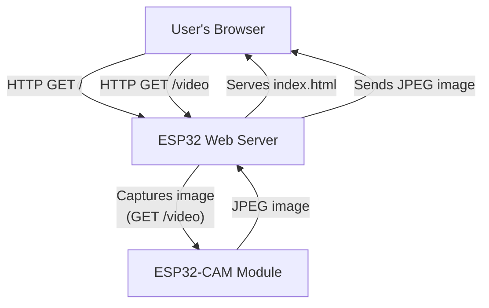
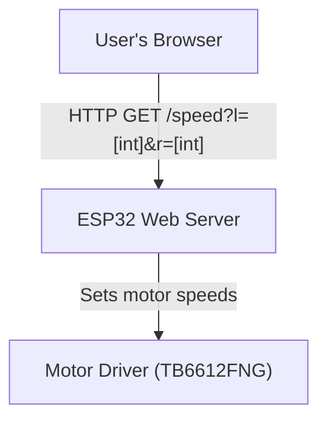

# ESP Cat
An ESP32-based robot cat with camera and motor control via a web interface.

## Functionality
### Web Server & Routes Diagram

- **/**: Loads the web interface (index.html) from the ESP32.
- **/video**: Captures a photo from the camera and returns it as a JPEG image.
- _Note: Not a true video feed, REST API for single images_

## Motor Control Diagram

