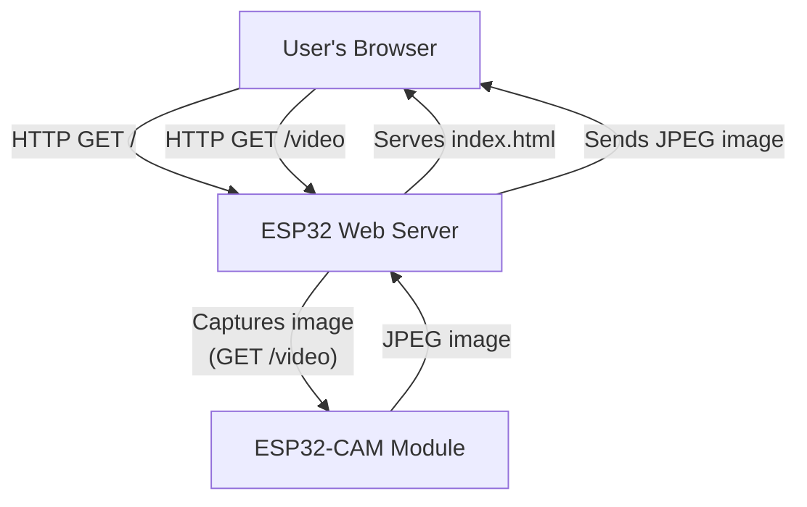
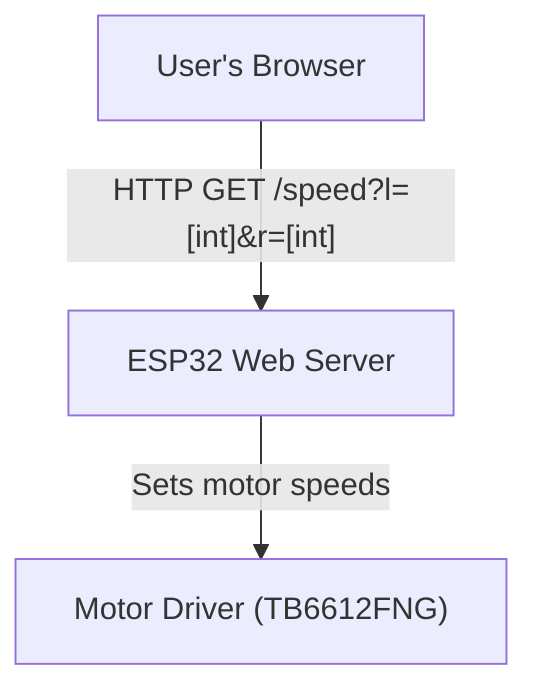
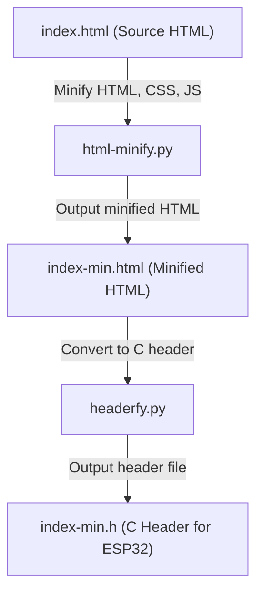

# ESP Cat
An ESP32-based robot cat with camera and motor control via a web interface.

## Functionality
### Web Server & Routes Diagram

- **/**: Loads the web interface (index.html) from the ESP32.
- **/video**: Captures a photo from the camera and returns it as a JPEG image.
- _Note: Not a true video feed, REST API for single images_

## Motor Control Diagram

- **/speed?l=[int]&r=[int]**: Sets the speed of the left (l) and right (r) motors. Speed values range from -255 to 255.
- **TB6612FNG** is used in a tank drive configuration.
## HTML Build Process Diagram

- **html-minify.py**: Minifies HTML, CSS, and JS from `index.html` to produce `index-min.html`.
- **headerfy.py**: Converts `index-min.html` into a C header file (`index-min.h`) for embedding in ESP32 firmware.